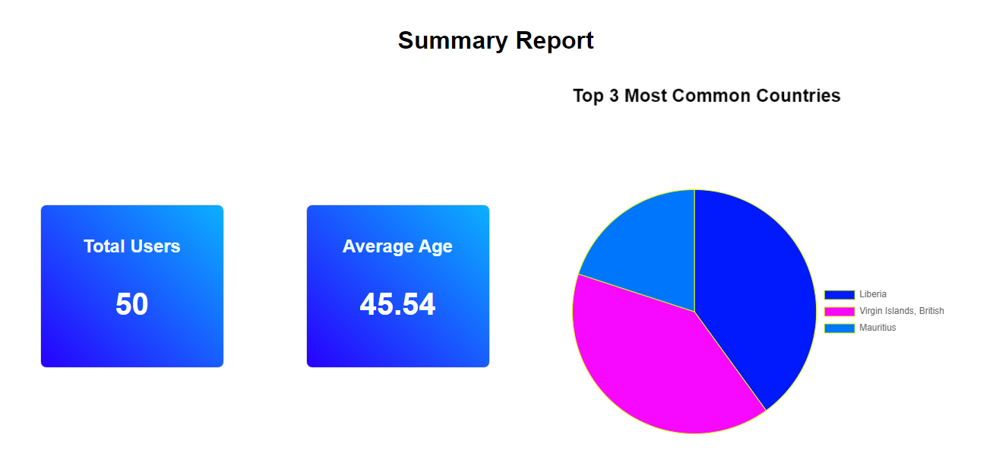

### **README for Summary Report Application**

---

### **Project Overview**

This project is a **Summary Report Application** built using **Node.js** for the backend and **React.js** for the frontend. The app processes user data from files, generates a summary report, and visualizes the results in an interactive web interface. The data includes:

- **Total number of users**
- **Average age of users**
- **Top 3 countries where users reside**

The backend reads user data files from the `/data` directory, validates the JSON structure, and computes the summary. The frontend displays the summary using **statistic cards** and a **Pie Chart** for easy data visualization.

---


### **Table of Contents**

1. [Features](#features)
2. [Technologies](#technologies)
3. [Setup and Installation](#setup-and-installation)
4. [Usage](#usage)
5. [Project Structure](#project-structure)
6. [API Endpoints](#api-endpoints)
7. [Customizing the Application](#customizing-the-application)
8. [Troubleshooting](#troubleshooting)
9. [License](#license)

---

### **Features**

- Reads `.txt` files containing JSON user data from a directory.
- Validates the JSON structure and logs any errors.
- Generates a summary report:
  - **Total number of users**.
  - **Average age of users**.
  - **Top 3 countries** based on user count.
- Displays summary results on a React frontend with:
  - **Statistic cards** for total users and average age.
  - An interactive **Pie Chart** for top 3 countries.
- Responsive design for mobile and desktop views.
- Includes hover animations for better UX.

---

### **Technologies**

- **Backend**:
  - Node.js
  - Express.js
  - File System (`fs`)
  - CORS for cross-origin requests
- **Frontend**:
  - React.js
  - Chart.js for data visualization
  - CSS (with flexbox for layout and animations)
- **Other Dependencies**:
  - react-chartjs-2
  - Chart.js

---

### **Setup and Installation**

#### **Prerequisites**

Make sure you have the following installed on your machine:

- Node.js (v14+)
- npm (Node Package Manager)
  
#### **Backend Setup**

1. Clone the repository or download the project:

    ```bash
    git clone https://github.com/officialforloop/summary-report.git
    cd summary-report/backend
    ```

2. Install backend dependencies:

    ```bash
    npm install
    ```

3. Run the Node.js server:

    ```bash
    npm start
    ```

   The backend server will start on **<http://localhost:3001>**.

4. Place the `.txt` files with valid JSON objects in the `/data` directory under the backend.

#### **Frontend Setup**

1. Navigate to the frontend directory:

    ```bash
    cd ../frontend
    ```

2. Install frontend dependencies:

    ```bash
    npm install
    ```

3. Run the React development server:

    ```bash
    npm start
    ```

   The frontend will start on **<http://localhost:3000>**.

---

### **Usage**

- **Backend**: Processes files from the `/data` directory and generates a summary report.
- **Frontend**: Fetches the summary report from the backend and displays it as:
  - **Statistic cards** for total users and average age.
  - A **Pie Chart** for top 3 countries.
  
Visit **<http://localhost:3000>** in your browser to view the summary report.

---

### **Project Structure**

```bash
├── backend
│   ├── data                # Directory for .txt files with user data
│   ├── error_log.txt       # Logs any JSON validation errors
│   ├── summary_report.txt  # Generated summary report (in JSON)
│   ├── index.js            # Express server code
│   └── package.json        # Backend dependencies
└── frontend
    ├── src
    │   ├── App.js          # React frontend code
    │   ├── App.css         # CSS for styling
    └── package.json        # Frontend dependencies
```

---

### **API Endpoints**

#### **GET /summary**

- **Description**: Fetches the generated summary report based on the user data.
- **Response**:

  ```json
  {
    "totalUsers": 50,
    "averageAge": 34.5,
    "topCountries": [
      "USA (15 users)",
      "Canada (12 users)",
      "UK (8 users)"
    ]
  }
  ```

---

### **Customizing the Application**

#### **To Modify the File Processing Logic:**

1. Go to `backend/index.js`.
2. Modify the `processFiles()` and `generateSummaryReport()` functions to add or change the logic for file handling and summary generation.

#### **To Customize the Frontend:**

1. Go to `frontend/src/App.js` for main component logic.
2. Modify `App.css` to update styling or animations.

---

### **Troubleshooting**

#### **Common Issues:**

1. **CORS Errors**:
   If you get cross-origin errors when fetching data from the frontend:
   - Ensure the CORS middleware is enabled on the backend (`app.use(cors())`).

2. **JSON Parsing Issues**:
   - If a file contains invalid JSON, check the `error_log.txt` file in the `/backend` directory for detailed error messages.

3. **Frontend Not Loading**:
   - Ensure both frontend (`http://localhost:3000`) and backend (`http://localhost:3001`) servers are running.
   - Clear your browser cache or use an incognito window to reload.

4. **No Data Displayed**:
   - Ensure `.txt` files are present in the `/data` directory with valid JSON user objects.

---

### **License**

This project is licensed under the MIT License. See the `LICENSE` file for more details.

---

### **Contributors**

- Tajudeen Muktar (Project Lead)
- Tajudeen Muktar (Backend Development)
- Tajudeen Muktar (Frontend Development)

---

### **Feedback and Contributions**

We welcome any feedback or contributions to the project! Feel free to open an issue or submit a pull request.

---
